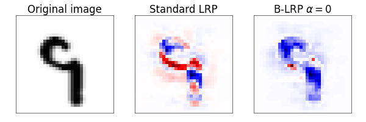

# B-LRP 
# How much can I trust you? - Quantifying Uncertainties in Explaining Neural Networks
https://arxiv.org/abs/2006.09000

We provide Pytorch implementations for our paper How Much Can I Trust You? — Quantifying Uncertainties in Explaining Neural Networks



## Requirements

To be able to run the code properly, please download the imagenet subset data by following link: https://www.dropbox.com/s/hbo7udo721igpnd/imagenet_data.zip?dl=0 and copy the 'imagenet_data' folder to a directory with notebooks

To install requirements:

```setup
pip install -r requirements.txt
```

All experiments were conducted with Python 3.6.9.

## Code structure:

The code is structured in the following way:

  * B-LRP MNIST
    This notebook consists of the code for visualization of B-LRP method for MNIST

  * B-LRP Imagenet
    This notebook consists of the code for visualization of B-LRP method for Imagenet

## Cite this paper:

To cite this paper use following Bibtex annotation:

	@article{bykov2020much,
	  title={How Much Can I Trust You?--Quantifying Uncertainties in Explaining Neural Networks},
	  author={Bykov, Kirill and H{\"o}hne, Marina M-C and M{\"u}ller, Klaus-Robert and Nakajima, Shinichi and Kloft, Marius},
	  journal={arXiv preprint arXiv:2006.09000},
	  year={2020}
	}
